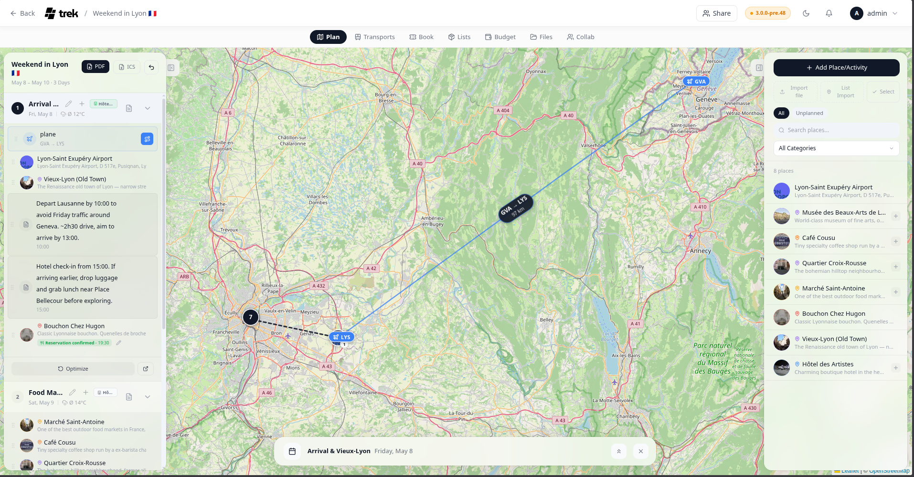

# Map Features

The trip planner map shows your places, route lines, transport overlays, and your current location in real time.

<!-- TODO: screenshot: trip map with place markers and route lines -->

## Map renderer

TREK uses **Leaflet** by default. If you configure a Mapbox access token in Settings → Map, the map upgrades to **Mapbox GL** with higher-quality tiles, 3D buildings, and terrain. If Mapbox GL is selected but no access token is present, TREK falls back to Leaflet automatically so the map is never blank.

The scopes required for Mapbox GL are:
- STYLES:TILES
- STYLES:READ
- FONTS:READ
- DATASETS:WRITE
- VISION:CREATE

## Place markers

Each place is shown as a circular marker:

- **Photo marker** — if the place has a photo (proxied from Google or another provider), that image appears in the circle.
- **Icon marker** — if no photo is available, a category-colored icon is shown instead.
- **Selected place** — the active place has a larger marker.
- **Order badge** — a small badge at the bottom-right of each marker shows the order number(s) of that place within the day's itinerary. If the place appears on multiple days, all order positions are shown separated by `·`.

When zoomed out, nearby markers are grouped into clusters. Clicking a cluster zooms the map to fit its members; at maximum zoom the cluster spiderfies to show individual markers.

## Route lines

When you have a day selected, a dark dashed line connects consecutive places in that day's order.

## Route time pills

At zoom level 12 or higher, small pill-shaped labels appear between consecutive places and show the estimated **walking time** and **driving time** for each segment. Below zoom 12 they are hidden to keep the map clean.

## Reservation and transport overlay

Flights, trains, cars, and cruises are drawn as overlays between their endpoint places:

- **Flights and cruises** — geodesic great-circle arcs
- **Trains and cars** — straight lines
- **Antimeridian crossings** — arcs that would cross the date line are split into sub-arcs to avoid wrapping across the map
- **Endpoint markers** — pill-shaped labels with the transport icon and the endpoint code (e.g. IATA airport code) or location name
- **Flight stats** — a floating label on the arc shows departure code → arrival code and, when times are available, the duration and great-circle distance. Stats labels are only rendered for flights.
- **Confirmed reservations** — solid line; **Pending** — dashed line

> **Admin:** Whether endpoint labels appear is controlled by the **Show connection labels** setting (`map_booking_labels`).

## Location button

The location button sits in the bottom-right corner of the map on mobile devices and cycles through three states:

| State | Icon | Behavior |
|---|---|---|
| Off | Outline locate | Location not tracked |
| Show | Solid blue locate | Your position is shown as a dot |
| Follow | Solid blue arrow | Map re-centers as you move |

If geolocation is denied or unavailable, the button turns red.

## Right-click / middle-click to create a place

Right-click anywhere on the **Leaflet** map to open the Place form with the clicked coordinates and a reverse-geocoded address already filled in.

On the **Mapbox GL** map, right-click is reserved for the built-in rotate/pitch gesture, so use **middle-click** instead to trigger the same Place form.

**See also:** [Places-and-Search](Places-and-Search) · [Day-Plans-and-Notes](Day-Plans-and-Notes) · [Route-Optimization](Route-Optimization) · [Map-Settings](Map-Settings) · [Reservations-and-Bookings](Reservations-and-Bookings)
